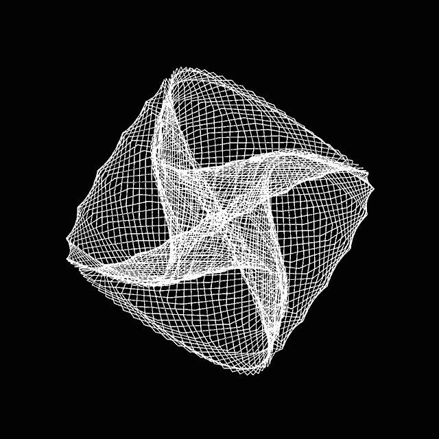
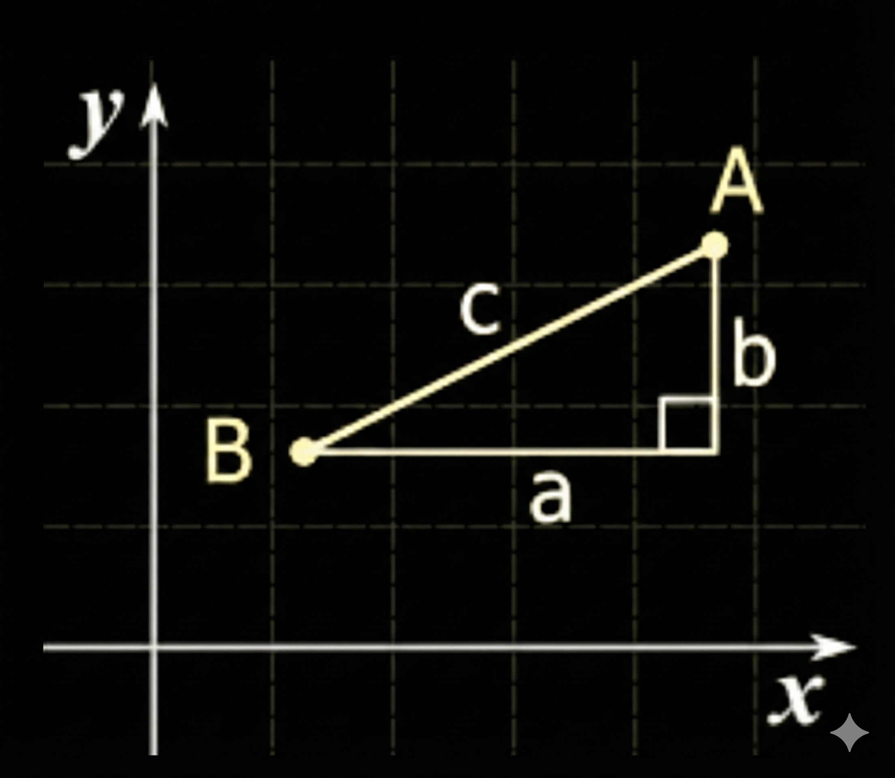

# Our Journey Today

<!-- column_layout: [1, 1] -->

<!-- column: 0 -->

## 1. Embeddings & Distance
- What are embeddings?
- How to compare vectors?
- Distance operators

## 2. Storage Deep Dive
- Where vectors live in Postgres
- TOAST behavior (1024d = 4KB!)
- Why size matters

## 3. Search Without Indexes
- Semantic search basics
- Sequential scan performance
- The O(N) problem

<!-- column: 1 -->

## 4. ANN Indexes
- IVFFlat: k-means clustering
- HNSW: hierarchical graphs
- 50-150x speedup!

## 5. Production Reality
- MVCC bloat problem
- Separate embedding tables
- Index strategy & tuning
- Best practices for scale

<!-- end_slide -->

# Chapter 1: What's an Embedding?

**Text → Numbers that capture meaning**

```
"I love pizza"     → [0.2, 0.8, 0.1, ... 384 numbers]
"Pizza is great"   → [0.3, 0.7, 0.2, ... 384 numbers]
"The sky is blue"  → [0.9, 0.1, 0.8, ... 384 numbers]
```

<!-- pause -->

**Key insight:** Similar meanings → Similar numbers!

*It's like teaching your database that "pizza" and "delicious" are besties* 🍕❤️

<!-- pause -->


**In other words:** We're teaching computers that "pizza" and "great" go together. 🍕

<!-- pause -->


<!-- end_slide -->

# 🎯 Let's See It In Action

**First: How similar are two pieces of text?**

```bash
python demo.py compare
```

<!-- end_slide -->

# Now Let's Store These Embeddings

**Step 1: Add some texts to Postgres**

```bash
python demo.py seed
```

<!-- end_slide -->

# Search Your Data

**Step 2: Find similar content**

```bash
python demo.py search
```

<!-- end_slide -->

# What Just Happened? Let's Look Inside

<!-- column_layout: [1, 1] -->

<!-- column: 0 -->

**Postgres stored our embeddings as vectors**

```sql
-- See all documents
SELECT id, content FROM demo;

-- Check embedding dimensions
SELECT id, content, array_length(embedding::float4[], 1) 
AS dimensions 
FROM demo LIMIT 3;

-- Peek at first 5 numbers
SELECT id, content,
       (embedding::float4[])[1:5] AS first_5_values
FROM demo LIMIT 3;
```

<!-- column: 1 -->



**The magic:** Text → 384 numbers → Semantic search ✨

<!-- pause -->

Why higher dimenions matter❓

<!-- reset_layout -->


<!-- end_slide -->

# Chapter 2: How Do We Compare Vectors?

**Now that we have embeddings stored, how do we find similar ones?**
 
<!-- pause -->
**We need a way to compare and that's distance functions!**




<!-- end_slide -->

# Three Distance Operators

| Operator | Name | Formula | Use When |
|----------|------|---------|----------|
| `<->` | L2 (Euclidean) | √(Σ(a-b)²) | Absolute distance matters (images) |
| `<=>` | Cosine | 1 - (a·b)/(‖a‖‖b‖) | Direction matters (text, most common) |
| `<#>` | Inner Product | -(a·b) | Pre-normalized vectors |


**Simple analogies:**
- **L2:** Two people in a city - how many blocks apart?
- **Cosine:** Two people facing directions - how similar?
- **Inner Product:** Two arrows - how aligned?

<!-- pause -->

**Most common:** Cosine `<=>` (works best for text embeddings)

*Think of it as three ways to measure how much your vectors "vibe" together* ✨


<!-- end_slide -->

# Example: Finding Similar Documents

```sql
-- Find similar docs using cosine distance
SELECT
  content,
  embedding <=> (
    SELECT embedding
    FROM demo
    WHERE content = 'Inflation is high'
    LIMIT 1
  ) AS distance
FROM demo
ORDER BY distance
LIMIT 5;
```

<!-- pause -->

**Key:** Lower distance = more similar (always use LIMIT!)

Cosine Distance varies from 0 to 2 and the cosine similarity angle varies from -1 to 1

<!-- end_slide -->

# Chapter 3: How Are Vectors Stored in Postgres?

**We know how to compare vectors, but where does Postgres actually store them?**

<!-- pause -->

**Let's explore step by step...**

<!-- end_slide -->

# Step 1: Create the Table

```sql
CREATE EXTENSION IF NOT EXISTS vector;

CREATE TABLE IF NOT EXISTS docs (
    id serial PRIMARY KEY,
    content text,
    embedding vector(1024)
);
```

<!-- end_slide -->

# Step 2: Load Demo Data

```bash
# Generate 50,000 documents with embeddings
python generate_demo_embeddings.py
```

<!-- pause -->

**This will:**
- Generate realistic random text using Faker
- Create 1024-dimensional embeddings (we will demonstrate TOAST!)
- Insert 50k rows into `docs` table

**I have preloaded this data to save time**

<!-- end_slide -->

# Step 3: Inspect the Data

```sql
-- How many documents?
SELECT COUNT(*) FROM docs;
-- Expected: 50000

-- See sample content
SELECT id, LEFT(content, 50) AS content_trunc FROM docs LIMIT 3;

-- Check embedding size
SELECT 
    id, 
    LEFT(content, 50) AS content_trunc,
    pg_column_size(embedding) AS embedding_bytes,
    array_length(embedding::float4[], 1) AS dimensions
FROM docs LIMIT 3;
```

<!-- pause -->

**Expected:** ~4 KB per 1024-dim embedding

<!-- end_slide -->

# Step 4: Where Is the Data Stored?

```sql
SELECT 
    pg_size_pretty(pg_relation_size('docs')) AS heap_size;
```

<!-- pause -->

**Let's do the math:**
- 50,000 docs × 1024 dimensions × 4 bytes = **200 MB**

<!-- pause -->

**But we only see:**
- Heap size: ~11 MB

<!-- pause -->

**Wait... where's the other ~189 MB?** 🤔


<!-- end_slide -->

# The Mystery Revealed: TOAST!

```sql
-- Check individual row and embedding size
SELECT 
    id,
    pg_column_size(embedding) AS embedding_bytes,
    pg_column_size(docs.*) AS row_bytes
FROM docs 
LIMIT 3;

-- Check TOAST table size
SELECT 
    c.relname AS table_name,
    pg_size_pretty(pg_relation_size(c.oid)) AS heap_size,
    pg_size_pretty(pg_relation_size(c.reltoastrelid)) AS toast_size,
    pg_size_pretty(pg_total_relation_size(c.oid)) AS total_size
FROM pg_class c
WHERE c.relname = 'docs';
```

<!-- pause -->

**Aha! 💡**
- Each embedding: ~4,100 bytes (> 2KB threshold!)
- Heap size: ~11 MB (just row headers)
- TOAST size: ~260 MB (94% of data is here!)
- Total: ~276 MB

**Key insight:** 1024d embeddings go to TOAST (> 2KB threshold) ✓

<!-- end_slide -->

# Chapter 4: What About Embedding Sizes?

**We saw TOAST in action with 1024d. But what if we used smaller embeddings?**

<!-- pause -->

**Let's compare different embedding sizes...**

<!-- column_layout: [1, 1] -->

<!-- column: 0 -->

**Our demo (50k docs, 1024d):**
```
Heap:  ████░░░░░░░░ ~50 MB
TOAST: ████████░░░░ ~200 MB
```
✓ Most embeddings in TOAST (demonstrates the problem!)

**If we used 384d instead:**
```
Heap:  ████████████ ~50 MB
TOAST: ░░░░░░░░░░░░  ~0 MB
```
✓ Embeddings stay in heap (no extra I/O!)

<!-- column: 1 -->

**Why does this matter?**

TOAST = extra I/O
- Every query reads from 2 places
- More disk seeks
- Slower performance

<!-- pause -->

**Recommendation:**
Use smaller models when possible!
- 384d: MiniLM, E5-small (~1.5 KB)
- 512d: E5-base (~2 KB, borderline)
- 1024d: BGE-large (~4 KB, TOASTed)

*Bigger isn't always better. Sometimes it's just... slower* 🦥


<!-- end_slide -->

# What is TOAST?

```
TOAST = "The Oversized-Attribute Storage Technique"
```

<!-- pause -->

**Not this kind of toast:** 🍞


<!-- pause -->

**Analogy:**

*It's like getting up to fetch a file every single time. Annoying, right?*

**Impact:** TOAST = extra I/O on every read!

<!-- end_slide -->

# Chapter 5: The Baseline - Search Without Indexes

**Now we understand storage. Let's actually search for similar documents!**

**First, let's see how it works WITHOUT any indexes...**

```sql
-- Get a random doc and check the content
SELECT content FROM docs WHERE id = 97;

-- Find similar docs
SELECT id, LEFT(content, 150) as contect_trunc,
       embedding <=> (
         SELECT embedding FROM docs WHERE id = 97
       ) AS distance
FROM docs
ORDER BY distance
LIMIT 5;
```

<!-- pause -->

**Notice:** Results are semantically similar! But how fast is it?

*Postgres checking every single row like:*

*"Is this the one? No. Is THIS the one? No..."*


<!-- end_slide -->

# Chapter 6: The Problem - Sequential Scan Performance

**The search works, but is it fast? Let's measure...**

<!-- pause -->

```sql
EXPLAIN ANALYZE
SELECT id, content,
       embedding <=> (
         SELECT embedding FROM docs WHERE id = 75
       ) AS distance
FROM docs
ORDER BY distance
LIMIT 5;
```

<!-- end_slide -->

# The Problem

<!-- column_layout: [1, 1] -->

<!-- column: 0 -->

**Observe:**
- Seq Scan on docs
- Reads all 50,000 rows
- ~500-2000ms query time
- High buffer reads (TOAST!)

<!-- column: 1 -->

**Without indexes:**
- Calculates distance for all 50k vectors
- Reads from TOAST for each
- O(N × dimensions) complexity

<!-- reset_layout -->

<!-- pause -->

**We need indexes! Like ANN (Approximate Nearest Neighbor)**

Why Approximate? Because exact search is too slow!

<!-- pause -->


<!-- pause -->

*This is fine.* 🔥☕


<!-- pause -->


<!-- end_slide -->

# Chapter 7: IVFFlat Index

**Sequential scan is too slow. We need indexes!**

**But how do you index high-dimensional vectors?**


Let's understand search methods first... apart from B+ tree variants used in for non vector indexing

<!-- end_slide -->

# IVFFlat - Inverted File Index with Flat Storage

**The name tells the story:**
- **Inverted File:** Like a book index - points to where things are
- **Flat:** Vectors stored as-is

<!-- pause -->

**Let's see how different search methods work...**

<!-- end_slide -->

# Sequential Scan (Brute Force)

**Query:** "machine learning algorithms"

To find semantic documents similar to this query

```
SAMPLE DOCUMENTS
================
Doc1: "The cat sat on the mat"
Doc2: "Dogs are loyal pets"
Doc3: "Cats and dogs are animals"
Doc4: "Machine learning uses neural networks"
Doc5: "Deep learning is a subset of machine learning"
Doc6: "Neural networks process data"
┌─────────────────────────────────────┐
│ Scan EVERY document:                │
├─────────────────────────────────────┤
│ Doc1: "cat sat mat"           ✗     │
│ Doc2: "dogs loyal pets"       ✗     │
│ Doc3: "cats dogs animals"     ✗     │
│ Doc4: "machine learning..."   ✓     │
│ Doc5: "deep learning..."      ✓     │
│ Doc6: "neural networks..."    ✗     │
└─────────────────────────────────────┘
```

Checked: **6/6 docs (100%)**


**Problem:** Must check EVERY document!

<!-- end_slide -->

# Inverted Index (TF-IDF)

**Analogy from Elasticsearch's TF-IDF:**

<!-- column_layout: [1, 1] -->

<!-- column: 0 -->

```
Pre-built index:
┌──────────────────────────────┐
│ "machine"  → [Doc4, Doc5]    │
│ "learning" → [Doc4, Doc5]    │
│ "neural"   → [Doc4, Doc6]    │
│ "cat"      → [Doc1, Doc3]    │
│ "dog"      → [Doc2, Doc3]    │
└──────────────────────────────┘
```

<!-- column: 1 -->

```
Query: "machine learning algorithms"
  ↓
Lookup: "machine" → [Doc4, Doc5]
Lookup: "learning" → [Doc4, Doc5]
Lookup: "algorithms" → []
  ↓
Intersect & rank: [Doc4, Doc5]
```

<!-- reset_layout -->

Checked: **2/6 docs (33%)**

<!-- end_slide -->

# IVFFlat (Vector Embeddings)

**How it works:**
1. Documents converted to vectors
2. K-means clustering groups similar vectors
3. Query searches only nearest cluster(s)


*It's like organizing your closet by color. Sure, you might miss that one blue shirt, but you'll find A blue shirt fast!* 👕


<!-- end_slide -->

# IVFFlat Clustering Visualization


**Key insight:** Don't search everything, just search the right neighborhood!

<!-- end_slide -->

# IVFFlat: Centroids Created

**After k-means clustering, we have centroids (cluster centers):**

```

Vector Space (2D projection):
    1.0 │
        │  ●Doc1                   ●Doc5
    0.8 │   ⭐A            
        │   [0.15,0.85]             ●Doc4
    0.6 │   ●Doc2               ⭐ B[0.70,0.75]
        │    ●Doc3.          ●Doc6   
    0.4 │                           
        │
    0.2 │
        │
    0.0 └─────────────────────────────
        0.0   0.2   0.4   0.6   0.8

Cluster A: [Doc1, Doc2, Doc3] → Centroid A: [0.15, 0.85]
Cluster B: [Doc4, Doc5, Doc6] → Centroid B: [0.70, 0.75]
```

<!-- pause -->

**Now let's see how search works...**

<!-- end_slide -->

# IVFFlat Search Process

**Query arrives: "machine learning algorithms" → [0.72, 0.82]**

```
Vector Space (2D projection):
    1.0 │
        │  ●Doc1                         ●Doc5
    0.8 │   ⭐A            Query 🟢 [0.72,0.82]
        │   [0.15,0.85]                  ●Doc4
    0.6 │   ●Doc2              ⭐ B[0.70,0.75]
        │    ●Doc3.          ●Doc6   
    0.4 │                           
        │
    0.2 │
        │
    0.0 └─────────────────────────────
        0.0   0.2   0.4   0.6   0.8
```

<!-- pause -->

**Which centroid is closest to the query?**

<!-- end_slide -->

# IVFFlat Search Process: Step by Step

```
Query: "machine learning algorithms"
  → Embedding: [0.72, 0.82]  (2D projection)
  ↓
1. Find nearest centroid(s):
   Centroid A: [0.15, 0.25]
     Distance to A: 0.95  ✗
   
   Centroid B: [0.70, 0.80]
     Distance to B: 0.03  ✓ (nprobe=1)
  ↓
2. Scan ONLY Centroid B cluster:
   Doc4: distance 0.02  ✓
   Doc5: distance 0.04  ✓
   Doc6: distance 0.08  ✗
```

<!-- end_slide -->

# Search Methods Summary

```
Sequential Scan:  Check everything
                  ████████████████████ 100%

TF-IDF:          Jump to exact matches
                  ████████░░░░░░░░░░░░ 33%

IVFFlat:         Jump to similar clusters
                  ███░░░░░░░░░░░░░░░░░ 20%
                  (trades accuracy for speed)
```

<!-- end_slide -->

# Lets see IVFFlat Index in action

```sql
SET maintenance_work_mem = '512MB';

CREATE INDEX docs_ivfflat_idx 
ON docs USING ivfflat (embedding vector_cosine_ops)
WITH (lists = 200);

ANALYZE docs;
```
<!-- pause -->

**Parameters:**
- lists = 200 (≈ sqrt(50k) ≈ 224) - So 200 clusters
- vector_cosine_ops - cosine distance - `<=>` operator for normalized embeddings

<!-- end_slide -->

# IVFFlat Performance

```sql
SET enable_seqscan = off;
SET ivfflat.probes = 1;

EXPLAIN (ANALYZE, BUFFERS)
SELECT id, content,
       embedding <=> (
         SELECT embedding FROM docs WHERE id = 1
       ) AS distance
FROM docs
ORDER BY distance
LIMIT 5;
```

<!-- pause -->

**Result:**
- Index Scan using docs_ivfflat_idx
- ~10-20ms (vs 500-2000ms!)
- ~1,000 buffers (vs ~300,000!)
- **50-100x faster**

<!-- end_slide -->

# Chapter 8: HNSW Index

**IVFFlat is fast, but...**
- Can miss good results (lower recall)
- Depends on good clustering
- Needs tuning (probes parameter)

<!-- pause -->

**Can we do better? Enter HNSW!**

Hierarchical Navigable Small World


<!-- end_slide -->

# HNSW Graph Structure


<!-- end_slide -->

# HNSW:

**How it works:**
- Hierarchical graph with multiple layers
- Navigates from sparse (top) to dense (bottom) layers
- Higher recall
- More consistent performance


<!-- end_slide -->

# HNSW Search Process - Layer 2

Query: "machine learning algorithms" → [0.72, 0.82, 0.08]

```
Step 1: Enter at LAYER 2 (random entry point)
┌─────────────────────────────────────────┐
│ Layer 2:                                │
│                                         │
│     [START] Doc4 ═══════════ Doc5       │
│              ↓                          │
│         dist: 0.02                      │
│                                         │
│ Greedy search: Doc4 is closest          │
│ Check neighbor Doc5: 0.04 (worse)       │
│ → Stay at Doc4                          │
└─────────────────────────────────────────┘
```

<!-- end_slide -->

# HNSW Search Process - Layer 1

```
Step 2: Drop to LAYER 1 (from Doc4)
┌─────────────────────────────────────────┐
│ Layer 1:                                │
│                                         │
│   Doc1 ──── Doc3                        │
│                                         │
│   [Doc4] ──── Doc5 ──── Doc6            │
│     ↓          ↓         ↓              │
│   0.02       0.04      0.10             │
│                                         │
│ Check Doc4's neighbors: Doc5, Doc6      │
│ → Doc4 still closest                    │
└─────────────────────────────────────────┘
```

<!-- end_slide -->

# HNSW Search Process - Layer 0

```
Step 3: Drop to LAYER 0 (from Doc4)
┌─────────────────────────────────────────┐
│ Layer 0:                                │
│                                         │
│   Doc1 ──── Doc2 ──── Doc3              │
│     │                   │               │
│   [Doc4] ──── Doc5 ──── Doc6            │
│                                         │
│ Distance from Query:                    │
│   Doc4: 0.02  ← CLOSEST!                │
│   Doc1: 0.03  (Doc4's neighbor)         │
│   Doc5: 0.04  (Doc4's neighbor)         │
│                                         │
│ Check Doc4's neighbors (Doc1, Doc5)     │
│ None closer than 0.02 → Stop at Doc4    │
│ → Final: Doc4 (nearest neighbor)        │
└─────────────────────────────────────────┘
```

<!-- end_slide -->

# HNSW Path Visualization

```
Query [0.72, 0.82, 0.08]
  │
  │ Layer 2: Express Highway
  ├──→ Doc4 ══════════ Doc5
  │     ✓ (closest)
  │
  │ Layer 1: Main Roads  
  ├──→ Doc4 ──── Doc5 ──── Doc6
  │     ✓       check    check
  │
  │ Layer 0: All Streets
  └──→ Doc4 ──── Doc5 ──── Doc6
        ✓✓       ✗       ✗
```

**Analogy:** Like GPS navigation - use highways first, then local roads

<!-- end_slide -->

# Restaurant Analogy

<!-- column_layout: [1, 1] -->

<!-- column: 0 -->

**Sequential Scan:**
```
Walk every street, check every building
🚶 → 🏠 → 🏠 → 🏠 → 🏠 → 🏠 → 🍽️

"Is this Italian? No. 
 Is this Italian? No..."
Check ALL restaurants one by one
```

**TF-IDF:**
```
Look up in phone book
📖 "Italian" → [Addr1, Addr2, Addr3]
🚗 → 🍽️ (direct jump)

Only visit restaurants 
labeled "Italian"
```

<!-- column: 1 -->

**IVFFlat:**
```
Jump to right neighborhood
🚁 → [Downtown] → 🏠 → 🏠 → 🍽️

Fly to Italian district
Search every restaurant in area
(even non-Italian)
```

**HNSW:**
```
Highway → Avenue → Street
🛫 → 🚗 → 🚶 → 🍽️
(L2)  (L1)  (L0)

Start at landmark restaurant
Follow signs to closer ones
```

<!-- end_slide -->

# Let's Try HNSW Index Now!

**IVFFlat was good, but HNSW promises:**
- ✅ Higher recall (~99% vs ~95%)
- ✅ More consistent performance
- ✅ Better for production workloads

<!-- pause -->

**Time to see it in action!** 🚀

```sql
DROP INDEX docs_ivfflat_idx;

CREATE INDEX docs_hnsw_idx 
ON docs USING hnsw (embedding vector_cosine_ops)
WITH (m = 16, ef_construction = 200);
```

**Parameters:**
- `m = 16`: Max connections per node (higher = better recall, larger index)
- `ef_construction = 200`: Build-time search depth (higher = better quality, slower build)
- `vector_cosine_ops` : cosine distance - `<=>` operator for normalized embeddings

<!-- end_slide -->

# Does HNSW Deliver? Let's Find Out!

```sql
SET hnsw.ef_search = 40;

EXPLAIN (ANALYZE, BUFFERS)
SELECT 
    id, 
    content,
    embedding <=> (SELECT embedding FROM docs WHERE id = 1) AS distance
FROM docs
ORDER BY embedding <=> (SELECT embedding FROM docs WHERE id = 1)
LIMIT 5;
```

**Parameter:**
- `ef_search = 40`: Query-time search depth (higher = better recall, slower search)
  - Default: 40
  - Trade-off: Speed vs accuracy

<!-- pause -->

**Observe:**
- ✅ Index Scan using docs_hnsw_idx
- ✅ Execution time: ~5-15ms

<!-- end_slide -->

# Performance Comparison

| Method   | Time  | Speedup | Accuracy    |
|----------|-------|---------|-------------|
| Seq Scan | 500-2000ms | 1x      | Perfect     |
| IVFFlat  | 10-20ms | 50-100x     | Approximate |
| HNSW     | 5-15ms | 70-150x     | High        |

<!-- pause -->

**Key:** 300x less I/O with indexes!

**Build time:** IVFFlat ~30-60s, HNSW ~2-5min

<!-- end_slide -->

# ⚠️ CRITICAL: Always Use LIMIT!

**Without LIMIT, Postgres won't use ANN indexes!**


```sql
-- BAD: No LIMIT = Sequential scan (even with indexes!)
SELECT * FROM docs 
ORDER BY embedding <=> '[...]';

-- GOOD: LIMIT = Uses ANN index
SELECT * FROM docs 
ORDER BY embedding <=> '[...]' 
LIMIT 10;
```

<!-- pause -->

**Why?** Without LIMIT, Postgres must sort ALL results → can't use approximate indexes.

```
Classical queries scan and sort all rows to return the top N; vector search maintains a fixed-capacity leaderboard, dynamically swapping out weaker matches for better ones as it traverses the graph
```

<!-- pause -->

*Forgetting LIMIT is like asking for "all the fries" and wondering why it's slow* 🍟


<!-- pause -->


<!-- end_slide -->

# Chapter 9: Production Challenges

**HNSW gives us great performance, but what about updates?**

<!-- pause -->

**Let's talk about MVCC bloat...**

<!-- end_slide -->

# MVCC Bloat - The Problem

**What is MVCC?**
Multi-Version Concurrency Control - Postgres's way of handling concurrent transactions

<!-- pause -->

**How it works:**
- UPDATE doesn't modify rows in-place
- Creates a NEW version, marks OLD version as dead
- Old versions stay until VACUUM cleans them up

<!-- pause -->

**Why it matters for vectors:**
```
UPDATE docs SET metadata = '{"views": 100}' WHERE id = 1;
```
- Postgres copies the ENTIRE row (including 4KB embedding!)
- Old 4KB embedding becomes "dead tuple" in TOAST
- Do this 5000 times = 20 MB of dead data
- Scale to 50k docs with frequent updates = GBs of bloat!

<!-- pause -->

*Database is basically hoarding old versions like: "But I might need this someday!"* 📦


<!-- end_slide -->

# Production Tips

**Now that we understand the challenges, how do we build production-ready systems?**

<!-- pause -->

**Let's go through 6 essential tips...**

<!-- end_slide -->

# Production Tips #1

**Separate embedding table**

**The Problem:** Updating document metadata duplicates 4KB embeddings!

```sql
CREATE TABLE documents (
  id serial, 
  title text,
  content text,
  metadata jsonb
);

CREATE TABLE embeddings (
  doc_id int REFERENCES documents(id),
  embedding vector(1024),
  content_hash text
);

-- Update metadata only
UPDATE documents 
SET metadata = '{"views": 100}' 
WHERE id = 1;
```
✅ No embedding duplication
✅ Less TOAST bloat
✅ Re-embed only when content changes

<!-- end_slide -->

# Production Tips #2-3

**We've separated tables. What about the embeddings themselves?**

<!-- column_layout: [1, 1] -->

<!-- column: 0 -->

**Use smaller models**

- 384d = 1.5 KB (stays inline!)
- 512d = 2 KB (borderline)
- 1024d = 4 KB (TOASTed, our demo)

**Smaller = less TOAST, faster queries**

<!-- column: 1 -->

**Increase maintenance_work_mem**

```sql
-- In postgresql.conf
maintenance_work_mem = 512MB
```

**Why:** Vector indexes need memory to build (especially for 50k+ rows)

<!-- end_slide -->

# Production Tips #4-5

**Smaller embeddings help, but what about indexing strategy?**

<!-- column_layout: [1, 1] -->

<!-- column: 0 -->

**Always ANALYZE after bulk inserts**

```sql
ANALYZE docs;
```

**Why:** IVFFlat needs statistics for clustering

<!-- column: 1 -->

**Create indexes AFTER bulk loading**

```sql
-- Bad: index exists during inserts
CREATE INDEX FIRST;
INSERT lots of data; -- Slow!

-- Good:
INSERT lots of data; -- Fast!
CREATE INDEX AFTER; -- One-time cost
```

<!-- pause -->

**Why?**
- **IVFFlat:** Incremental inserts can create poor clusters (local minima)
- **HNSW:** Each insert requires graph traversal and rebalancing (slow)

<!-- pause -->

**Best practice:** Bulk load first, then index!

<!-- end_slide -->

# Production Tips #6

**One more critical detail about vector queries...**

<!-- pause -->

**Use LIMIT for ANN - It's Different!**

<!-- column_layout: [1, 1] -->

<!-- column: 0 -->

**Classical SQL:**
```sql
-- LIMIT = "stop after N rows"
SELECT * FROM users 
ORDER BY created_at 
LIMIT 10;
```
1. Scan all rows
2. Sort all results
3. Return top 10

<!-- column: 1 -->

**Vector Search:**
```sql
-- LIMIT = "use ANN index!"
SELECT * FROM docs 
ORDER BY embedding <=> '[...]' 
LIMIT 10;
```

1. Think 10 like bucket
2. Add & Keeps the best 10 in that bucket
3. Discards others probabilistically

<!-- reset_layout -->

<!-- end_slide -->

# When to Use What?

<!-- column_layout: [1, 1] -->

<!-- column: 0 -->

**Use IVFFlat when:**
- ✅ Batch/analytics workloads
- ✅ Can tolerate ~95% recall
- ✅ Faster index build needed (~30-60s)
- ✅ Memory constrained (smaller index)
- ✅ Write-heavy workloads (faster inserts)

**Example use cases:**
- Nightly batch similarity jobs
- Data exploration/analysis
- Development/testing environments

<!-- column: 1 -->

**Use HNSW when:**
- ✅ Production user-facing apps (low-latency required)
- ✅ Need high recall (~99%)
- ✅ Read-heavy workloads (slow inserts acceptable)
- ✅ Can afford larger index size & build time

**Example use cases:**
- Real-time search APIs
- Recommendation systems
- Chatbot/RAG applications
- Production semantic search

<!-- reset_layout -->

**TL;DR:** HNSW for read-heavy production, IVFFlat for write-heavy or batch workloads

<!-- end_slide -->

# When to Use Alternatives in PostgreSQL

**pgvector is great, but not always the answer:**

<!-- pause -->

**Use PostgreSQL Full-Text Search (FTS) when:**
- ✅ Exact keyword matching needed
- ✅ Boolean queries (AND, OR, NOT)
- ✅ Phrase matching required
- ✅ Language-specific stemming needed

<!-- pause -->

**Use sequential scan when:**
- ✅ < 1,000 documents (brute force is fine)
- ✅ One-time queries (index build cost not worth it)
- ✅ 100% accuracy required (no approximation)

<!-- pause -->

**Use external vector DB when:**
- ✅ > 10M vectors (specialized systems scale better)
- ✅ Need advanced features (filtering, hybrid search)
- ✅ Multi-tenancy with isolation

<!-- pause -->

**TL;DR:** pgvector is perfect for 1k-10M vectors with PostgreSQL

<!-- end_slide -->

# Key Takeaways

**The Big Picture:**

PostgreSQL + pgvector handles 1k-10M vectors in production. No specialized database needed.

We covered:

**- Storage Reality**

**- Index Strategy**

**- Production Gotchas**

**The Bottom Line:**

ACID + SQL + existing infrastructure.

*Postgres can do semantic search* 🎉


<!-- end_slide -->

# The End

**Postgres can handle semantic search at scale!**

*Now go forth and vector!* 🚀


**Questions?**

📬 **Get in touch:** jeevandc24@iimb.ac.in  
*(Not active on social media)*

**Slides & Code:**

```
█████████████████████████████████████
█████████████████████████████████████
████ ▄▄▄▄▄ █▀ ▄ ▀█▄ ▀█▄▄▀█ ▄▄▄▄▄ ████
████ █   █ █▄█  ▄█ ▀█▄ ▄▄█ █   █ ████
████ █▄▄▄█ █ ▄█▄█ █  ▀ ▀██ █▄▄▄█ ████
████▄▄▄▄▄▄▄█ ▀▄▀ █▄▀▄▀ ▀ █▄▄▄▄▄▄▄████
████ ▄▀ █▀▄ ▀█▄▄▀ ▄▄▄▀ ▄▀█ ▄▄▀▄▄▀████
████  █▀▄ ▄██▄▄█▀ ▄███ ▄▄▄██ ▄  █████
█████▀▀▄█▄▄▀▄█▀▄▄ ▄██▄▄   ▄██▄█▄▄████
████▀██   ▄▄▀ ▄ ▀▀ █▀▀▀█ ▀ ▄▄ ▄ ▄████
██████ █▀█▄▄█▄▄▀ ▀█▄▀▄▀█ ▀▀ █▀█▄▀████
████▄█▀ █ ▄ ▀  █▀▄ ▀▄▀▄█▀ █  ██  ████
████▄█████▄▄ ▄█▄   █▀▀█  ▄▄▄ █ ▀▀████
████ ▄▄▄▄▄ █▄▀▄██ ▀█▄▄▀█ █▄█ ▀▀ █████
████ █   █ █▀▀▄█  ██▄ ▀▀ ▄   ▀▀▄▄████
████ █▄▄▄█ █▀ ▀▄▄  ▀▀▀█  ▀██ ▄▄▀▄████
████▄▄▄▄▄▄▄█▄▄███████▄██▄▄▄▄▄▄█▄█████
█████████████████████████████████████
█████████████████████████████████████
```


<!-- end_slide -->

# Appendix

IVFFlat & HNSW Build Process Details

<!-- end_slide -->

# IVFFlat Step 0: Raw Data

```
Doc1: "The cat sat on the mat"        → [0.1, 0.2, 0.9]
Doc2: "Dogs are loyal pets"           → [0.2, 0.3, 0.8]
Doc3: "Cats and dogs are animals"     → [0.15, 0.25, 0.85]
Doc4: "Machine learning neural nets"  → [0.7, 0.8, 0.1]
Doc5: "Deep learning subset"          → [0.75, 0.85, 0.05]
Doc6: "Neural networks process data"  → [0.65, 0.75, 0.15]
```

⚠️  **CRITICAL:** Must load ALL vectors into memory first!

<!-- end_slide -->

# IVFFlat Step 1: Initialize Centroids

Randomly pick K=2 initial centroids:

```
Vector Space (2D projection):
    1.0 │
        │  ●Doc1
    0.8 │  ●Doc2              ●Doc5
        │   ●Doc3            ●Doc4
    0.6 │                   ●Doc6
        │
    0.4 │  C1 (random)
        │
    0.2 │              C2 (random)
        │
    0.0 └─────────────────────────────
        0.0   0.2   0.4   0.6   0.8

Initial Centroids:
  C1 = [0.2, 0.3, 0.8]  (random pick)
  C2 = [0.7, 0.8, 0.1]  (random pick)
```

<!-- end_slide -->

# IVFFlat Step 2: Assign to Clusters (1/2)

Calculate distance from each vector to each centroid:

```
Doc1 [0.1, 0.2, 0.9]:
  → distance to C1: 0.14  ✓ (closer)
  → distance to C2: 0.95
  → Assign to Cluster 1

Doc2 [0.2, 0.3, 0.8]:
  → distance to C1: 0.00  ✓ (exact match!)
  → distance to C2: 0.85
  → Assign to Cluster 1

Doc3 [0.15, 0.25, 0.85]:
  → distance to C1: 0.08  ✓
  → distance to C2: 0.90
  → Assign to Cluster 1
```

<!-- end_slide -->

# IVFFlat Step 2: Assign to Clusters (2/2)

```
Doc4 [0.7, 0.8, 0.1]:
  → distance to C1: 0.85
  → distance to C2: 0.00  ✓ (exact match!)
  → Assign to Cluster 2

Doc5 [0.75, 0.85, 0.05]:
  → distance to C1: 0.92
  → distance to C2: 0.08  ✓
  → Assign to Cluster 2

Doc6 [0.65, 0.75, 0.15]:
  → distance to C1: 0.78
  → distance to C2: 0.08  ✓
  → Assign to Cluster 2
```

<!-- end_slide -->

# IVFFlat Voronoi Diagram

```
Voronoi Diagram (Iteration 1):
    1.0 │
        │  ●Doc1
    0.8 │  ●Doc2              ●Doc5
        │   ●Doc3            ●Doc4
    0.6 │                   ●Doc6
        │  ╔═══════╗ ║ ╔═══════╗
    0.4 │  ║   C1  ║ ║ ║   C2  ║
        │  ║Cluster║ ║ ║Cluster║
    0.2 │  ║   1   ║ ║ ║   2   ║
        │  ╚═══════╝ ║ ╚═══════╝
    0.0 └──────────────────────────
              BOUNDARY
```

<!-- end_slide -->

# IVFFlat Step 3: Recalculate Centroids

```
Cluster 1: [Doc1, Doc2, Doc3]
  New C1 = mean([0.1, 0.2, 0.9], 
                [0.2, 0.3, 0.8], 
                [0.15, 0.25, 0.85])
  New C1 = [0.15, 0.25, 0.85]  ← MOVED!

Cluster 2: [Doc4, Doc5, Doc6]
  New C2 = mean([0.7, 0.8, 0.1], 
                [0.75, 0.85, 0.05], 
                [0.65, 0.75, 0.15])
  New C2 = [0.70, 0.80, 0.10]  ← MOVED!
```

<!-- end_slide -->

# IVFFlat Centroids Moved

```
    1.0 │
        │  ●Doc1
    0.8 │  ●Doc2              ●Doc5
        │   ●Doc3  ⭐C1      ●Doc4  ⭐C2
    0.6 │                   ●Doc6
        │
        │  (Centroids moved to cluster centers)
```

<!-- end_slide -->

# IVFFlat Step 4: Iterate Until Convergence

```
Repeat Steps 2-3 until centroids stop moving:

Iteration 2:
  - Recalculate distances
  - Reassign vectors
  - Update centroids
  
Iteration 3:
  - Recalculate distances
  - Reassign vectors
  - Update centroids

... CONVERGED! (centroids don't move)
```

<!-- end_slide -->

# IVFFlat Final Structure

```
┌─────────────────────────────────────┐
│ Centroid 1: [0.15, 0.25, 0.85]      │
│   ├─ Doc1 [0.1, 0.2, 0.9]           │
│   ├─ Doc2 [0.2, 0.3, 0.8]           │
│   └─ Doc3 [0.15, 0.25, 0.85]        │
│                                     │
│ Centroid 2: [0.70, 0.80, 0.10]      │
│   ├─ Doc4 [0.7, 0.8, 0.1]           │
│   ├─ Doc5 [0.75, 0.85, 0.05]        │
│   └─ Doc6 [0.65, 0.75, 0.15]        │
└─────────────────────────────────────┘
```

<!-- end_slide -->

# HNSW Step 0: Start Empty

```
Doc1: "The cat sat on the mat"        → [0.1, 0.2, 0.9]
Doc2: "Dogs are loyal pets"           → [0.2, 0.3, 0.8]
Doc3: "Cats and dogs are animals"     → [0.15, 0.25, 0.85]
Doc4: "Machine learning neural nets"  → [0.7, 0.8, 0.1]
Doc5: "Deep learning subset"          → [0.75, 0.85, 0.05]
Doc6: "Neural networks process data"  → [0.65, 0.75, 0.15]
```

✓ NO need to load all data at once!
✓ Can insert one vector at a time

<!-- end_slide -->

# HNSW Parameters

```
M = 2        (max connections per layer)
efConstruction = 3  (search width during build)
mL = 1/ln(2) (layer probability multiplier)
```

<!-- end_slide -->

# HNSW Insert Doc1

```
Step 1: Determine max layer
  Random: level = floor(-ln(random()) × mL) = 2

Step 2: Insert into all layers (0 to 2)

Layer 2:
  [Doc1]  ← First node, no connections

Layer 1:
  [Doc1]  ← First node, no connections

Layer 0:
  [Doc1]  ← First node, no connections

Current Index:
┌─────────────────────┐
│ Layer 2: Doc1       │
│          │          │
│ Layer 1: Doc1       │
│          │          │
│ Layer 0: Doc1       │
└─────────────────────┘
```

<!-- end_slide -->

# HNSW Insert Doc2

```
Step 1: Determine max layer
  Random: level = 0 (most nodes go to layer 0 only)

Step 2: Search for nearest neighbors
  Start at top layer with entry point Doc1
  
  Layer 2: Doc1 (entry point, skip - Doc2 not here)
  Layer 1: Doc1 (skip - Doc2 not here)
  Layer 0: Find nearest to Doc2
    → Doc1 distance: 0.14

Step 3: Connect Doc2 to M=2 nearest neighbors
  Layer 0: Doc2 ←→ Doc1
```

<!-- end_slide -->

# HNSW After Doc2

```
Current Index:
┌─────────────────────┐
│ Layer 2: Doc1       │
│          │          │
│ Layer 1: Doc1       │
│          │          │
│ Layer 0: Doc1 ←→ Doc2│
└─────────────────────┘
```

<!-- end_slide -->

# HNSW Layer Assignment

```
Each node gets random layer based on exponential decay:

Layer 0: ████████████████████ 100% (all nodes)
Layer 1: ████████░░░░░░░░░░░░  50% (half)
Layer 2: ████░░░░░░░░░░░░░░░░  25% (quarter)
Layer 3: ██░░░░░░░░░░░░░░░░░░  12.5%
Layer 4: █░░░░░░░░░░░░░░░░░░░   6.25%

Formula: P(layer ≥ L) = (1/2)^L
```

Creates a skip-list structure!

<!-- end_slide -->

# HNSW Final Structure

```
┌──────────────────────────────┐
│ Layer 2: Doc1 ═══════ Doc4   │
│          ║           ║       │
│ Layer 1: Doc1 ──── Doc3      │
│          ║           ║       │
│         Doc4 ──── Doc6       │
│          ║           ║       │
│ Layer 0: Doc1 ──── Doc2      │
│          │ ╲       │         │
│         Doc3 ──────┘         │
│                              │
│         Doc4 ──── Doc5       │
│          │ ╲       │         │
│         Doc6 ──────┘         │
└──────────────────────────────┘
```

<!-- end_slide -->

# HNSW Connection Rules

**During insertion:**

1. **Search Phase:**
   - Start at top layer
   - Greedy search: move to closer neighbor
   - Drop layer when stuck

2. **Connection Phase:**
   - Find M nearest neighbors
   - Connect to them
   - Prune to maintain M max

<!-- end_slide -->

# HNSW Incremental Build

```
Insert Order: Doc1 → Doc2 → Doc3 → Doc4 → Doc5 → Doc6

After Doc1:
  [Doc1]

After Doc2:
  [Doc1]──[Doc2]

After Doc3:
  [Doc1]──[Doc2]
    ╲      ╱
     [Doc3]

After Doc4 (new cluster!):
  [Doc1]──[Doc2]    [Doc4]
    ╲      ╱
     [Doc3]

After Doc5:
  [Doc1]──[Doc2]    [Doc4]──[Doc5]
    ╲      ╱
     [Doc3]

After Doc6:
  [Doc1]──[Doc2]    [Doc4]──[Doc5]
    ╲      ╱          ╲      ╱
     [Doc3]            [Doc6]
```

<!-- end_slide -->

<!-- end_slide -->

# HNSW Tuning

<!-- column_layout: [1, 1] -->

<!-- column: 0 -->

```sql
-- Higher ef_search = 
-- better recall, slower

SET hnsw.ef_search = 40;  
-- Good default

SET hnsw.ef_search = 100; 
-- Higher accuracy
```

<!-- column: 1 -->

**Build parameters:**
- `m = 16` 
  max connections per node
- `ef_construction = 200` 
  build quality

<!-- end_slide -->

# References

- HNSW: https://www.pinecone.io/learn/series/faiss/hnsw/
- HNSW: https://www.mongodb.com/resources/basics/hierarchical-navigable-small-world
- IVFFlat: https://milvus.io/docs/ivf-flat.md
- TOAST: https://www.postgresql.org/docs/current/storage-toast.html
- TOAST: https://www.tigerdata.com/blog/what-is-toast-and-why-it-isnt-enough-for-data-compression-in-postgres
- MVCC: https://www.postgresql.org/docs/7.1/mvcc.html


